<div align="center">

# 𝄐 Fermata

**A debugger for GitHub Actions.**
Pause a failing workflow, look inside, fix it, and re-run just the broken step.



[](https://github.com/aradar46/fermata/actions/workflows/ci.yml)
[](LICENSE)

</div>

> **𝄐** *fermata*: the musical symbol for "hold this note as long as you need,
> then continue." That is exactly what this does to a CI pipeline.

---

## The problem

Your pipeline fails seconds to minutes in, after checkout, install, and build.

You read the log, guess the fix, push a commit, and wait for all of it to run
again. Then you find out you guessed wrong.

## What Fermata does

It stops at the failure and keeps the container alive. You look inside, fix one
line, and re-run **only that step**, about a second. Then the job continues.

```
⏸  fermata paused at step "Run tests" — step failed: exitcode '1'

   last output from the step:
   │ AssertionError: expected 45, got 49.8

   container: act-CI-test-9f3c…

   commands: continue  quit  env  shell  retry  skip  (help)

fermata> retry
  re-running step "Run tests"
  | all tests passed
  retry succeeded — `continue` to resume the rest of the job
```

Measured on the bundled [demo](demo/), where setup takes 24 seconds before the
test step fails:

| | |
|---|---|
| Reach the failure | **24s** |
| Fix one line and `retry` | **1s** |

Nothing before the failing step runs again. On a real pipeline that setup is
minutes rather than seconds, and the retry is still about a second.

It reads your existing `.github/workflows/*.yml` unchanged. No migration, no
new syntax, nothing to annotate.

---

## Install

**Linux.** Download a binary from
[releases](https://github.com/aradar46/fermata/releases):

```sh
curl -L -o fermata https://github.com/aradar46/fermata/releases/latest/download/fermata-linux-amd64
chmod +x fermata && sudo mv fermata /usr/local/bin/
```

Replace `amd64` with `arm64` on ARM. Checksums are published alongside.

**macOS.** Homebrew, which compiles it on your machine:

```sh
brew install aradar46/tap/fermata
```

No macOS binary is shipped, so nothing untested reaches you: the formula
compiles from source with your own Go toolchain.

**Windows, or building from source.** Clone and build. Go 1.26+:

```sh
git clone https://github.com/aradar46/fermata && cd fermata
go build -ldflags "-X github.com/aradar46/fermata/cmd.version=$(git describe --tags)" -o fermata .
```

Development happens on Linux. CI builds and launches Fermata on macOS every
push, but no macOS runner can run Linux containers, so the debug loop itself
is unexercised there; **Windows hosts are untested and the interactive prompt
likely has rough edges**. The shell handoff and terminal handling need
console-specific work. Reports welcome either way.

<details>
<summary><b>Why there's no <code>go install</code></b></summary>

`go install github.com/aradar46/fermata@latest` fails, by design. Go refuses
any module whose `go.mod` has a `replace` directive, and Fermata uses one to
wire in its patched act.

Removing it is possible: rewrite the vendored fork's import path so it becomes
an ordinary package. I measured the cost: the fork's divergence from upstream
goes from **7 files to 64**, because every internal import changes. That trades
the one property that answers "will this fork rot?" for one convenient command.

The 7-file patch is worth more than `go install`. It's the difference between
a fork you can rebase in an afternoon and one you can't.

</details>

**Requires Docker.** Fermata runs your workflow in containers, like
[act](https://github.com/nektos/act) does.

## Try it

The repo ships a deliberately broken project. From a clone:

```sh
cd demo
fermata run -W .github/workflows/ci.yml --bind
```

It fails at `Run tests` and pauses. Fix the one-line bug in `src/cart.js`
(the discount is applied to the item count instead of the subtotal), type
`retry`, and watch just that step re-run. [demo/SCRIPT.md](demo/SCRIPT.md) is
the full walkthrough.

## Use it

From the root of a repo that has workflows:

```sh
fermata run -W .github/workflows/ci.yml
```

That pauses whenever a step fails. Add `--bind` if you plan to fix **source
files** while paused, so your edits reach the retry:

```sh
fermata run -W .github/workflows/ci.yml --bind
```

### At the prompt

| Command | What it does |
|---|---|
| `shell` | open a shell inside the paused container |
| `env` | print the step's environment (secrets masked) |
| `retry` | re-run this step after your fix |
| `continue` | resume the rest of the job |
| `skip` | mark this step skipped and carry on |
| `quit` | stop the run |
| `history` | recent commands, including past sessions (the command list persists to a file; container state does not) |

`retry` re-reads the workflow from disk, so your edits take effect. It finds the
step by id, then name, never by position (which shifts when you edit the file).

### Common flags

| Flag | For |
|---|---|
| `--break "step name"` | pause at a specific step instead of on failure |
| `--bind` | make edits to source files visible to `retry` |
| `--secret-file .secrets` | pass secrets (also `--secret KEY=value`) |
| `--event workflow_dispatch` | workflows that don't trigger on `push` |
| `-P ubuntu-latest=my/image` | use your own image, or map a self-hosted label |
| `--matrix python:3.12` | debug one matrix leg instead of all of them |
| `--reuse` | keep the container so build caches survive |

<details>
<summary><b>Running without a terminal (CI, scripts)</b></summary>

An interactive prompt needs a human. `--hold` keeps the failed container alive
instead, tells you how to reach it, then continues:

```sh
fermata run -W ci.yml --hold 30m
```
```
⏸  fermata holding step "Run tests" — step failed: exitcode '1'
   get a shell:  docker exec -it act-CI-test-9f3c… bash
   clean up:     docker rm -f act-CI-test-9f3c…
```

</details>

<details>
<summary><b>Wrapping Fermata in another tool</b></summary>

`--json` emits one JSON object per line on stdout (job logs move to stderr), so
other tools can consume a run without parsing human-readable output:

```sh
fermata run -W ci.yml --json | jq -r 'select(.kind=="paused") | .container'
```

Event kinds: `paused`, `resumed`, `retried`, `skipped`, `quit`,
`shell_opened`, `shell_closed`.

</details>

---

## What it can and can't do

Every limit here is something you'd otherwise hit as a surprise.

### Works

- Linux jobs. `ubuntu-*` out of the box; other labels, including self-hosted,
  once you map them with `-P`.
- `run:` steps and `uses:` steps.
- Matrix jobs, one leg at a time with `--matrix`.

### Doesn't work

- **`windows-*` and `macos-*` jobs.** They can't run in Linux containers.
- **Reusable workflows** (`workflow_call`).
- **Steps needing GitHub's own services.** OIDC tokens, the cache service, the
  artifacts service. There's nothing for them to talk to locally.

Fermata reports which jobs it can't run, and why, *before* it starts.

### Things to know

- **Retry doesn't roll anything back.** It runs against whatever state the
  failed step left behind. Fermata says so every time.
- **Container state is session-only.** Quit and the container is gone. Ctrl-C
  while paused asks first. (`history` is the exception: the list of commands
  you typed persists to a file.)
- **Secrets aren't masked inside the shell.** They're masked in Fermata's own
  output, but once you have a shell, `echo $TOKEN` prints it. Don't
  screen-share a session with real credentials.
- **It runs the workflow's code on your machine**, including any action it
  uses. Same trust decision as `npm install` on a branch you didn't write.
  See [SECURITY.md](SECURITY.md).

### Fidelity

Fermata is as accurate as act is, plus the gaps above. The usual surprise is
tooling GitHub's runners ship that the container image doesn't. The Android
SDK especially. Fermata names that kind of failure instead of leaving you a
stack trace:

```
⏸  fermata paused at step "Build release AAB" — step failed: exitcode '1'

   likely cause: the Android SDK is not installed in this container image
   GitHub's ubuntu runners ship it; catthehacker/ubuntu:act-latest does not.
```

Usually fixable by pointing at an image that has the tooling:
`-P ubuntu-latest=your/image:tag`.

---

## Built on act

[act](https://github.com/nektos/act) is the project that made running GitHub
Actions locally possible. The hard parts (parsing workflows, evaluating
expressions, resolving actions, orchestrating containers) are all act's work.

Fermata adds the one thing act doesn't have: stopping at a step and re-running
it.

**Why not `action-tmate` or `breakpoint`?** Those SSH you into GitHub's runner
mid-run. Same idea, but you wait for the queue, burn CI minutes while you
think, and lose the box when the job times out. Fermata is that loop without
leaving your machine. The tradeoff is fidelity: tmate gives you GitHub's real
runner, Fermata gives you a container that is close but not identical. See
[Fidelity](#fidelity).

It vendors act v0.2.89 with a **211-line patch across 7 files**. That number is
published because it's the honest answer to "will this fork rot?". Small
enough to rebase in an afternoon. CI checks on every push that the patch still
applies to a clean upstream checkout. Details in [docs/fork/](docs/fork/).

## Contributing

Bug reports, especially a workflow Fermata handles badly, are the most useful
thing you can send. [CONTRIBUTING.md](CONTRIBUTING.md) lists what's wanted and
what will be rejected.

```sh
go build -o fermata .
go test ./internal/...        # fast, no Docker
./scripts/fidelity-test.sh    # needs Docker; proves retry env fidelity
```

## Layout

| Path | What |
|---|---|
| [cmd/](cmd/) | the CLI |
| [internal/engine/](internal/engine/) | thin seam onto act: plan, run, wire the hook |
| [internal/controller/](internal/controller/) | pause gate, prompt, diagnosis |
| [demo/](demo/) | demo project and walkthrough script |
| [packaging/homebrew/](packaging/homebrew/) | the brew formula (mirrored to the tap) |
| [third_party/act-fork/](third_party/act-fork/) | vendored act + Fermata's patches |
| [docs/](docs/) | fork patches, design notes |

## License

[MIT](LICENSE). The vendored act fork retains act's own MIT copyright notice.
